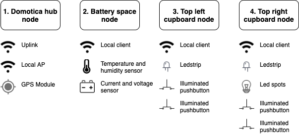

# Digital Herbert - Buscamper automation project
In 2019 we bought a van to convert into a buscamper and called him Herbert de Campert 🚐, you can follow the physical build process on [Instagram](https://www.instagram.com/herbertdecampert/). This project describes the work in progress on the automation of our camper. It will be based on Home Assistant and ESPHome.

## Overview

## Hardware
- Raspberry Pi 3B
- NodeMCU v3
- 100A Shunt
- INA3221
- DHT22
- WS2812 LED strip
- LED Ceiling lights
- 5V 5A DC-DC Buck converter

## Modules
### Accu monitor
The accu monitor module is build around an NodeMCU V3 and is measuring temperature in the "battery-room" and the actual voltage and current flowing in or out of the battery. Temperature is measured using an DHT22 module (with pull-up resistor). Energy is measured using an [INA3221 I2C Shunt monitor module](https://nl.aliexpress.com/item/32828796768.html) with an external [100A Shunt](https://nl.aliexpress.com/item/32879352313.html). After receiving the INA3221 module I found out it was build with internal shunts and I had to modify the module to be able to use it for my purpose. I removed the internal shunt and connected the supply side external shunt to the POW/VIN1+ pin and the load side to the VIN1-/P1.1 pin. The NodeMCU is directly powered by the 12V car-battery and the sensors are powered by the regulated 3.3v from the NodeMCU board.

**Pinouts**
- INA3221 (SDA GPIO4/D2, SCL GPIO5/D1)
- DHT22 (D7)

## Software
- [Home Assistant](https://www.home-assistant.io/)
  - [Custom WiFi access point addon](https://github.com/joosthb/hassio-addons)
- [ESPHome](https://esphome.io/)

## Bill of materials
- ["Chinese diesel heater"](https://nl.aliexpress.com/item/32836642933.html)
