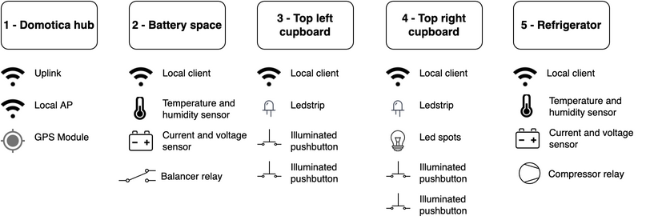

# Digital Herbert - Buscamper automation project

In 2019 we bought a van to convert into a buscamper and called it Herbert de Campert 🚐, you can follow the physical build process on [@herbertdecampert](https://www.instagram.com/herbertdecampert/). This page describes the work in progress on the automation of our camper. It is be based on a Raspberry Pi with Home Assistant and several ESP8266 modules with ESPHome.


## Overview



The project is build around a Raspberry Pi 3B (core hub), three NodeMCU v3 modules (wireless io) and various sensors and actuators. The NodeMCU modules are equiped with internal voltage regulators so they can be powered directly by the car battery. Power-thirsty hardware modules are powered by efficient 5V 5A DC-DC Buck converters.

The van automation logic is built using [Home Assistant](https://www.home-assistant.io/) and [ESPHome](https://esphome.io/). The _domotica hub_ is serving a local WiFi access point (hostapd) to which the other modules connect. It also connects to available and known wireless access points (home wifi, mobile hotspot etcetera) for uplink.

### 1 - Domotica hub node

This module is the core of Digital Herbert. The hardware is a Rasberry Pi 3B equiped with an additional USB Wifi Module (TP-Link TL-WN722N v2) and a USB GPS Module (U-Blox AG, u-blox 7).

The recommended deployment of Home Assistant relies on the Home Assistant Operating System (HassOS), a light-weight docker host OS. Because the Raspberry does not have a real time clock (RTC) HassOS requires an network time protocol (NTP) server to sync the system clock to, otherwise it will not boot. There's no permanent internet connection available in the campervan so an USB GPS Module is used as time source. Also the hub needs to serve a local WiFi access point with a wireless uplink connection. These unordinary requirements were not feasable on HassOS so [Raspberry Pi OS](https://www.raspberrypi.org/downloads/raspberry-pi-os/) (previously called Raspbian) is used instead.

### 2 - Battery space node

The battery space node is build around an NodeMCUv3 and measures temperature, humidity and the actual voltage and current flowing from or to the battery. It can switch the battery charger and the power converter off at night (because of the annoying sound of 45mm fans). Temperature is measured using an DHT22 module (with pull-up resistor). Energy is measured using an [INA3221 I2C 3-channel Shunt monitor module](https://nl.aliexpress.com/item/32828796768.html) with three external shunt resistors [Shunt](https://nl.aliexpress.com/item/4000064064917.html):

- 10A - Solar panel.
- 20A - Consumers (refrigerator, lights, radio etc..).
- 30A - Car engine generator.

The INA3221 module is build with internal shunts and needs to be modified to be able to use it with an external shunt. The internal shunt has to be removed and the supply side of the external shunt has to be connected to the POW/VIN1+ pin. The load side of the shunt has to be connected to the VIN1-/P1.1 pin. The NodeMCU is directly powered by the 12V car-battery and the sensors are powered by the regulated 3.3v from the NodeMCU board.

**Pinout**

- INA3221 (SDA GPIO4/D2, SCL GPIO5/D1)
- DHT22 (D7)

### 3 - Top left cupboard node

This node is also a NodeMCU v3 controlling a WS2812B LED-strip (175 LEDs) and has two illuminated push butons.

### 4 - Top right cupboard node

Same but 102 LEDs and a relay to switch the LED-spots on the ceiling.

## Home Assistant configuration

### Bluetooth

Added car-radio as [bluetooth audio device](https://github.com/evzone/hassio-bluepiaudio).

## Local compile esphome

Since compiling esphome firmware is pretty heavy on a raspberry with limited internet uplink (as is in camper) local (laptop) compile is preferred. Therefore, esphome is split into a different compose file.

Deployment strategy is to run following locally:

```
docker compose -f compose.local.yaml up
```

Then "UPDATE ALL" from dashboard [http://localhost:6052/](http://localhost:6052/).

Then rerun from within RV.


# Raspberry pi bootstrapping

## Flash SD card

with [Raspberry Pi OS Lite 64 bit](https://www.raspberrypi.org/downloads/raspberry-pi-os/) to SD card using [Raspberry Pi Imager](https://www.raspberrypi.com/software/) and use the preferences button to set; enable ssh, uplink wifi network, hostname, authentication and locales/TZ.

## Bootstrap

Run `bootstrap/bootstrap.sh` locally to initiate remote target and setup git.

## Deploy

- populate secrets.yaml and .env, see example.

```
scp .env herbert:/home/$USER/.homeassistant/bootstrap/
scp ../secrets.yaml herbert:/home/$USER/.homeassistant/
```

- store above files in your personal password manager
- Execute install script

- Use `sudo raspi-config` tool to config autologin: select “Console Autologin”.

## GPS time sync trouble

Since raspi doesn't have a RTC it depends on GPS for timesync. Home-assistant depends on a synced datetime so:

```
# To enable wait for timesync;
sudo systemctl enable systemd-time-wait-sync

# manual timesync
sudo chronyc waitsync

# Confirm syncing
sudo timedatectl status
```
